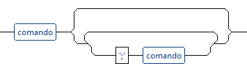
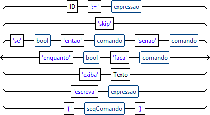
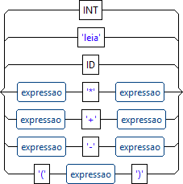
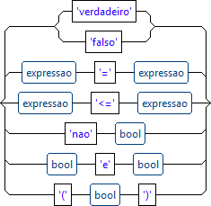
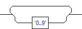
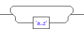
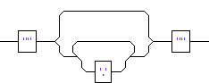
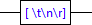

# Enquanto.g4

## Regras

1. programa
2. seqComando
3. comando
4. expressao
5. bool
6. INT
7. ID
8. Texto
9. Espaco

-
### programa

#### Text notation:

`programa : seqComando ;`

#### Visual notation:

-
### seqComando

#### Text notation:

`seqComando : comando (';' comando)\* ;`

#### Visual notation:

-
### comando

#### Text notation:

`comando : `
`    ID ':=' expressao # atribuicao`
`  | 'skip' # skip`
`  | 'se' bool 'entao' comando 'senao' comando # se`
`  | 'enquanto' bool 'faca' comando # enquanto`
`  | 'exiba' Texto # exiba`
`  | 'escreva' expressao # escreva`
`  | '{' seqComando '}' # bloco ;`

#### Visual notation:

-
### expressao

#### Text notation:

`expressao : INT # inteiro | 'leia' # leia | ID # id | expressao '\*' expressao # opBin | expressao '+' expressao # opBin | expressao '-' expressao # opBin | '(' expressao ')' # expPar ;`

#### Visual notation:

-
### bool

#### Text notation:

`bool : ('verdadeiro'|'falso') # booleano | expressao '=' expressao # opRel | expressao ' expressao # opRel | 'nao' bool # naoLogico | bool 'e' bool # eLogico | '(' bool ')' # boolPar ;`

#### Visual notation:

-
### INT

#### Text notation:

`INT : ('0'..'9')+ ;`

#### Visual notation:

-
### ID

#### Text notation:

`ID : ('a'..'z')+ ;`

#### Visual notation:

-
### Texto

#### Text notation:

`Texto : '"' .\*? '"' ;`

#### Visual notation:

-
### Espaco

#### Text notation:

`Espaco : [ \t\n\r] -> Skip ;`

#### Visual notation:

Generated by: [ANTLR 4 IDE](https://github.com/jknack/antlr4ide). Copyright (c) 2013 [Edgar Espina](https://twitter.com/edgarespina)
